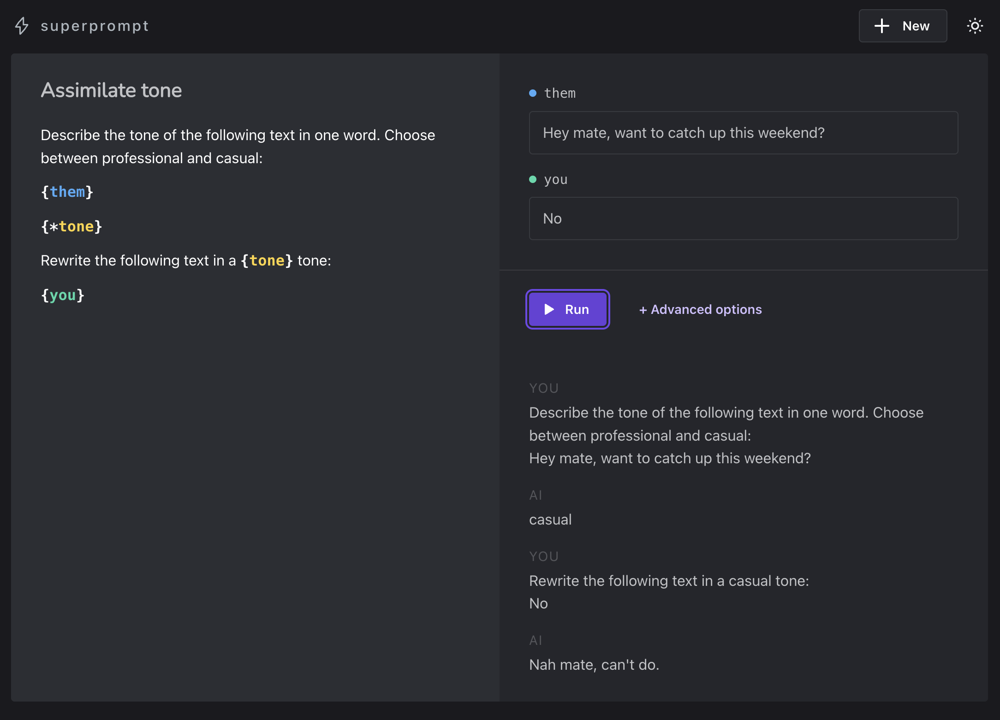

<div align="center">
  <a href="https://github.com/dvtng/superprompt">
      
  </a>
  <h1 align="center">superprompt</h1>
  <p align="center">
    The Prompt Development Environment for GPT.
  </p>
  
</div>

## Use

To quickly get started, visit [superprompt.dvtng.com](https://superprompt.dvtng.com). Alternatively, follow the instructions below to run it locally.

## Running locally

Clone this repository.

```sh
git clone https://github.com/dvtng/superprompt.git
```

Install dependencies.

```sh
cd superprompt
npm run install
```

Start the server.

```sh
npm run dev
```

## Writing prompt templates

Superprompt enables you to create prompt templates with placeholders.

### Variables

A `{name}` is a **variable** placeholder that allows you to input values for substitution.

```
What is a good product name for {product_description}?
```

### Generators

Use the `{*}` **generator** placeholder to create multi-step conversations.

```
Name 3 experts who'd be great at answering "{question}"
{*}
Now answer the question from the perspective of each expert.
```

When encountering a **generator** placeholder, superprompt yields to GPT to generate the next message.

You can combine a **generator** placeholder with a variable name to store the generated output.

```
Describe the tone of the following text in one word. Choose between professional and casual:
{them}
{*tone}
Rewrite the following text in a {tone} tone:
{you}
```

In this example, the generated `{*tone}` value is stored and reused as `{tone}` later in the prompt.

### Functions (experimental)

Superprompt provides two built-in functions: `query` and `summarize`, for working with text files.

Please note that these are currently experimental and may change in the future.

#### query(question)

Searches a file for excerpts that are related to the question and outputs them.

```
Consider the following excerpts:
---
{book:query(question)}
---
Pretend to be the character {character_name} from the above excerpts.
I'm going to ask you questions and I want you to respond as {character_name} would.
Take care to mimic their personality and mannerisms.
Let's start.
{question}
```

#### summarize

Summarizes the contents of a file.

```
The following is a book summary:
---
{book:summarize}
---
Give me 5 adjectives that describe the book.
```
